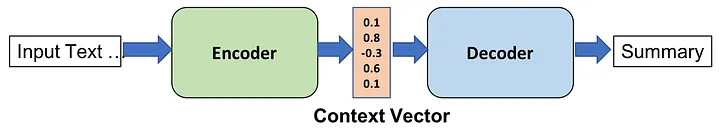

# 🌟 English-Urdu Translation using RNN and LSTM 🌟

## 📖 Introduction
In today's interconnected world, language translation plays a crucial role in breaking communication barriers. This project aims to develop a **machine translation model** that accurately translates **English** sentences into **Urdu** using **Recurrent Neural Networks (RNN)** and **Long Short-Term Memory (LSTM)** networks. By focusing on the nuances of both languages, we aim to provide a robust solution for low-resource language translation.

---
<div style="text-align: center;">
    
</div>


## 💻 Installation

To set up this project, follow these steps:

### 1. Clone the repository:
```bash
git clone https://github.com/saadsohail05/English-Urdu-Translation-using-RNN-and-LSTM.git
cd English-Urdu-Translation-using-RNN-and-LSTM
```

### 2. Install required libraries:
**Using Poetry (Recommended):**
```bash
poetry install
```

**Using pip:**
```bash
pip install -r requirements.txt
```

---

## 🚀 Usage

1. **Prepare your dataset:** Ensure your dataset of English-Urdu sentence pairs is ready, formatted in a DataFrame with columns `SENTENCES` and `MEANING`.

2. **Run the Jupyter Notebook:**
   Launch Jupyter Notebook:
   ```bash
   jupyter notebook
   ```
   Open the notebook file and follow the instructions to train and evaluate the model.

3. **Make predictions:** Use the trained model to translate new English sentences into Urdu through the defined functions in the notebook.

---

## ✨ Features

- **RNN and LSTM Models:** Implementation of state-of-the-art RNN and LSTM architectures for effective sequence-to-sequence translation.
- **Data Preprocessing:** Automated functions for cleaning and preparing data, including tokenization and padding.
- **Model Training & Evaluation:** Tools to train the model and evaluate its performance on test datasets with visualizations of metrics.
- **Interactive Prediction Interface:** A user-friendly interface to input English sentences and receive Urdu translations instantly.

---

## 📊 Data

The project utilizes a dataset of English-Urdu sentence pairs sourced from publicly available resources. The data is stored in **CSV format**, consisting of:

| Column      | Description                     |
|-------------|---------------------------------|
| `SENTENCES` | English sentences               |
| `MEANING`   | Corresponding Urdu translations |

### Preprocessing Steps
- **Tokenization:** Splitting sentences into individual words.
- **Padding:** Ensuring uniform input lengths for model compatibility.

---

## 🔍 Methodology

This project leverages **RNN** and **LSTM** architectures to effectively capture temporal dependencies in sequential data. The implementation involves:

- **TensorFlow** for building and training neural networks.
- **Pandas** for data manipulation.
- **NumPy** for numerical computations.

The workflow consists of data preprocessing, model training, and generating translations for new input sentences.


---

## 📄 Research Papers
For a deeper understanding of the techniques employed in this project, consider reviewing the following research papers:

1. **Sequence to Sequence Learning with Neural Networks**  
   *By Ilya Sutskever, Oriol Vinyals, and Quoc V. Le*  
   [Paper Link](https://arxiv.org/abs/1409.3215)

2. **Long Short-Term Memory**  
   *By Sepp Hochreiter and Jürgen Schmidhuber*  
   [Paper Link](https://www.bioinf.jku.at/publications/older/2604.pdf)

---

## 📝 Conclusion

This project successfully implements a machine translation model that translates English sentences into Urdu using RNN and LSTM architectures. The results indicate a promising potential for further development and optimization.

---

## 🌱 Future Work

- **Model Optimization:** Exploring advanced architectures such as Transformer models for enhanced performance.
- **Dataset Expansion:** Incorporating a wider variety of sentence pairs to improve translation accuracy.
- **User Interface Development:** Creating a web-based interface for seamless interaction with the translation model.

---

## 🤝 Contributing

Contributions are welcome! If you have suggestions or improvements, please submit an issue or a pull request. For queries or discussions, feel free to reach out.


## 📜 License
This project is licensed under the MIT License - see the [LICENSE](LICENSE) file for details.

---
